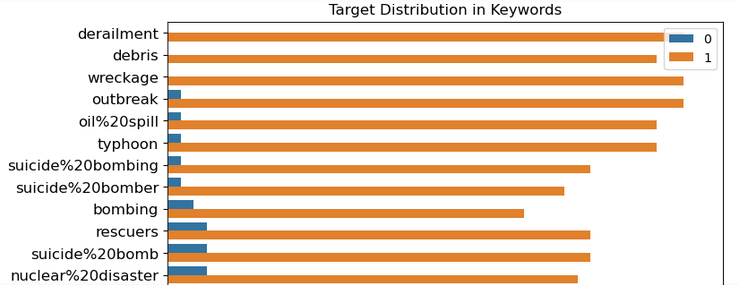

# Kaggle: Disaster tweets analysis - NLP problem
In this notebook I explore some NLP techniques using Disaster tweets data provided on Kaggle. Dataset contains more than 7 thousand tweets among which some are about disaster and some are not. The goal is to explore data and find the best performing algoritm that can classify new data into disaster and not-disaster categories.

First of all some data exploration needs to be done to learn more about data. 

Afterwards some preprocessing is being applied to remove from tweets unnecessary words or punctuation. This step makes it easier for algorithms to process the data and extract only relevant information from tweets.
Finally 
